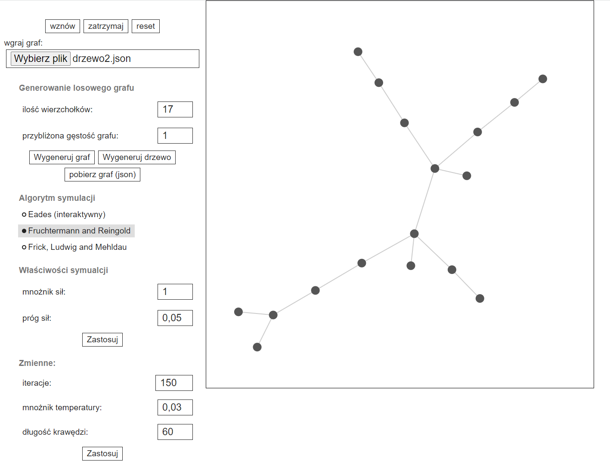
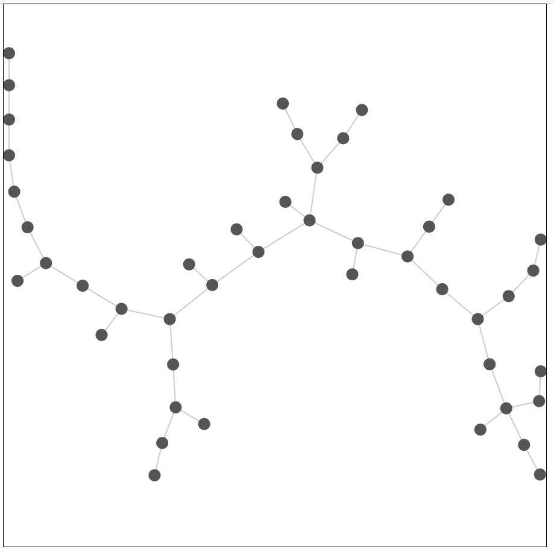
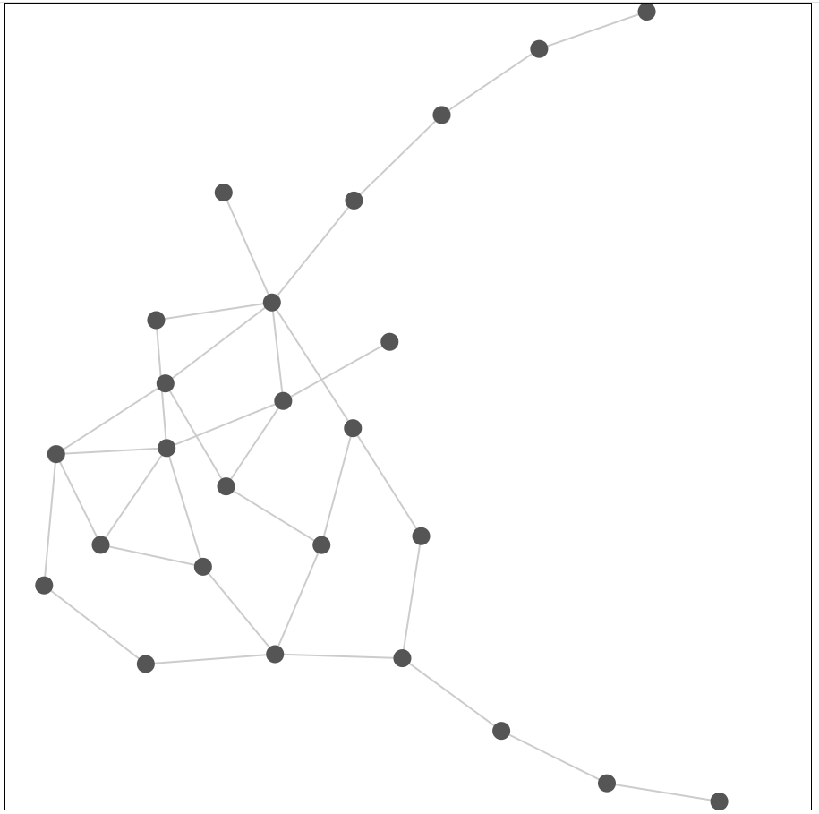
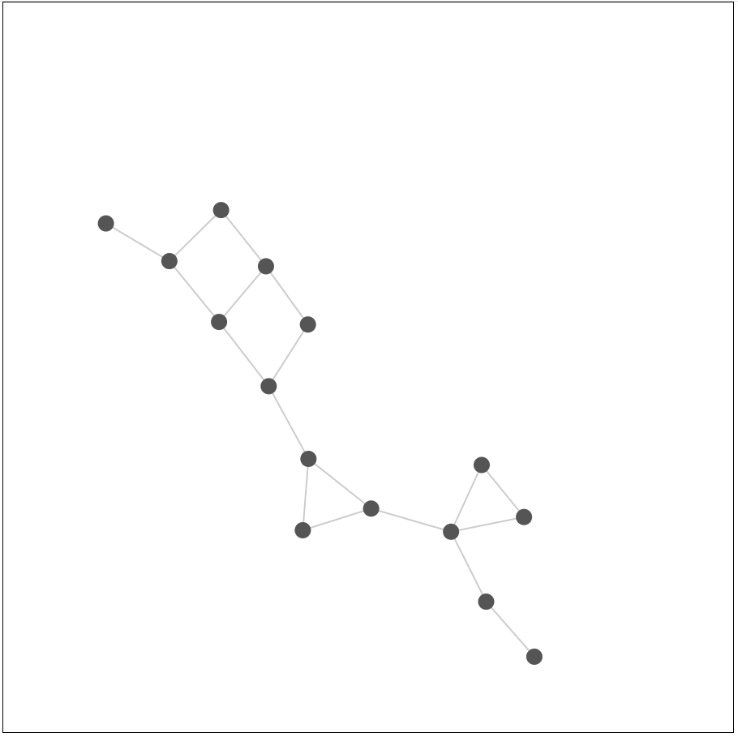

# Force-directed graph drawing

Project for the course on Combinatorial Optimization at the Poznan University of Technology.

## Overview

Force-directed graph drawing algorithms are a family of algorithms aimed at creating clear and aesthetically pleasing visualizations of graphs. Edges are typically modeled as springs whose tension depends on the distance between their endpoints, while vertices are simulated as repelling particles with identical electric charges. These algorithms operate by minimizing the system's energy through simulations of its physical properties.

This tool implements three graph layout algorithms:

   - The algorithm proposed by Peter Eades [1]
   - The algorithm proposed by Thomas M. J. Fruchterman and Edward M. Reingold [2]
   - The algorithm proposed by Arne Frick, Andreas Ludwig, and Heiko Mehldau [3]

The program allows users to:

 - load pre-prepared graph or generate a random one
 - choose an algorithm and setup simulation's parameters (one can also modify parameters during simulation)
 - observe the vertex placement process
 - play with force simulation in interactive mode

## References:

  [1] P. Eades. A heuristic for graph drawing. Congressus Numerantium, 1984.

  [2] T. Fruchterman and E. Reingold. Graph drawing by force-directed placement. Softw. – Pract.Exp., 1991.

  [3] A. Frick, A. Ludwig, and H. Mehldau. A fast adaptive layout algorithm for undirected graphs. In R. Tamassia and I. G. Tollis, editors, Proceedings of the 2nd Symposium on Graph Drawing (GD), volume 894 of Lecture Notes in Computer Science. Springer-Verlag, 1995.

  [4] Force-Directed Drawing Algorithms; Stephen G. Kobourov; University of Arizona

## Tech stack

HTML, CSS, JS, D3.js

## How to run

This is a 100% browser-based, client-side application, so just open the `index.html` file in any modern web browser.

## Interface

## Example generated graph layouts

## [Polish version]

# Rysowanie grafu oparte na odwzorowaniu sił fizycznych

Projekt na przedmiot optymalizacja kombinatoryczna na Politechnice Poznańskiej.

## O projekcie

Algorytmy rysujące graf w oparciu o symulację fizyczną (ang. Force-directed graph drawing algorithms) to rodzina algorytmów mających za zadanie stworzyć przejrzystą i estetyczną wizualizację grafu. Krawędzie najczęściej odwzorowane są jako sprężyny, których napięcie zależy od odległości między wierzchołkami końcowymi, natomiast wierzchołki symulowane są jako odpychające się cząsteczki o jednakowym ładunku elektrycznym. Działanie algorytmów oparte jest na minimalizacji energii układu poprzez symulacje jego fizycznych właściwości.

Stworzone przeze mnie narzędzie implementuje trzy algorytmy rozmieszczające grafy:

1. algorytm zaproponowany przez Petera Eadesa [1]
2. algorytm zaproponowany przez Thomasa M. J. Fruchtermana i Edwarda M. Reingolda [2]
3. algorytm zaproponowany przez Arne Frick, Andreas Ludwig i Heiko Mehldau [3]

Program pozwala obserwować proces rozmieszczania wierzchołków na losowo wygenerowanych lub wcześniej przygotowanych grafach, wybranie algorytmu oraz zmianę parametrów używanych.

## Bibliografia:

  [1] P. Eades. A heuristic for graph drawing. Congressus Numerantium, 1984.

  [2] T. Fruchterman and E. Reingold. Graph drawing by force-directed placement. Softw. – Pract.Exp., 1991.

  [3] A. Frick, A. Ludwig, and H. Mehldau. A fast adaptive layout algorithm for undirected graphs. In R. Tamassia and I. G. Tollis, editors, Proceedings of the 2nd Symposium on Graph Drawing (GD), volume 894 of Lecture Notes in Computer Science. Springer-Verlag, 1995.

  [4] Force-Directed Drawing Algorithms; Stephen G. Kobourov; University of Arizona
